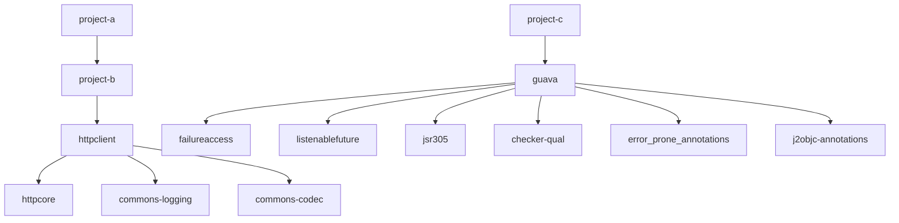

```mermaid
graph TD;
  project-a-->project-b;
  project-b-->httpclient;
  httpclient-->httpcore;
  httpclient-->commons-logging;
  httpclient-->commons-codec;
  project-c-->guava;
  guava-->failureaccess;
  guava-->listenablefuture;
  guava-->jsr305;
  guava-->checker-qual;
  guava-->error_prone_annotations;
  guava-->j2objc-annotations;
```