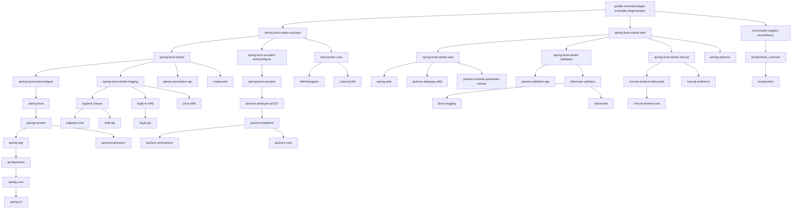

```mermaid
graph TD;
  gradle-mermaid-plugin-example-single-project-->spring-boot-starter-actuator;
  spring-boot-starter-actuator-->spring-boot-starter;
  spring-boot-starter-->spring-boot-autoconfigure;
  spring-boot-autoconfigure-->spring-boot;
  spring-boot-->spring-context;
  spring-context-->spring-aop;
  spring-aop-->spring-beans;
  spring-beans-->spring-core;
  spring-core-->spring-jcl;
  spring-context-->spring-expression;
  spring-boot-starter-->spring-boot-starter-logging;
  spring-boot-starter-logging-->logback-classic;
  logback-classic-->logback-core;
  logback-classic-->slf4j-api;
  spring-boot-starter-logging-->log4j-to-slf4j;
  log4j-to-slf4j-->log4j-api;
  spring-boot-starter-logging-->jul-to-slf4j;
  spring-boot-starter-->jakarta.annotation-api;
  spring-boot-starter-->snakeyaml;
  spring-boot-starter-actuator-->spring-boot-actuator-autoconfigure;
  spring-boot-actuator-autoconfigure-->spring-boot-actuator;
  spring-boot-actuator-->jackson-datatype-jsr310;
  jackson-datatype-jsr310-->jackson-databind;
  jackson-databind-->jackson-annotations;
  jackson-databind-->jackson-core;
  spring-boot-starter-actuator-->micrometer-core;
  micrometer-core-->HdrHistogram;
  micrometer-core-->LatencyUtils;
  gradle-mermaid-plugin-example-single-project-->spring-boot-starter-web;
  spring-boot-starter-web-->spring-boot-starter-json;
  spring-boot-starter-json-->spring-web;
  spring-boot-starter-json-->jackson-datatype-jdk8;
  spring-boot-starter-json-->jackson-module-parameter-names;
  spring-boot-starter-web-->spring-boot-starter-validation;
  spring-boot-starter-validation-->jakarta.validation-api;
  spring-boot-starter-validation-->hibernate-validator;
  hibernate-validator-->jboss-logging;
  hibernate-validator-->classmate;
  spring-boot-starter-web-->spring-boot-starter-tomcat;
  spring-boot-starter-tomcat-->tomcat-embed-websocket;
  tomcat-embed-websocket-->tomcat-embed-core;
  spring-boot-starter-tomcat-->tomcat-embed-el;
  spring-boot-starter-web-->spring-webmvc;
  gradle-mermaid-plugin-example-single-project-->micrometer-registry-prometheus;
  micrometer-registry-prometheus-->simpleclient_common;
  simpleclient_common-->simpleclient;
```